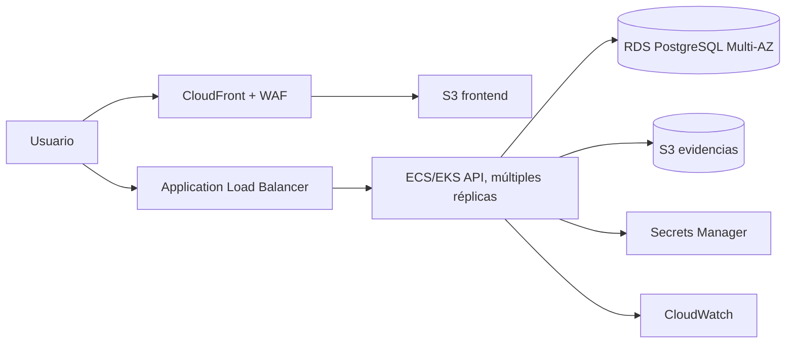

# Arquitectura futura AWS

> Propuesta de escalamiento futuro, no desplegada en el MVP.

Una evolución posible: Angular en S3/CloudFront; API en contenedores ECS/EKS detrás de ALB y Auto Scaling; PostgreSQL RDS Multi-AZ; evidencias en S3 mediante URLs firmadas; secretos en Secrets Manager; métricas/logs/alarmas en CloudWatch; WAF, backups y réplicas según RPO/RTO.

No hay manifiestos Kubernetes aplicados, recursos AWS, SLA ni pruebas de alta disponibilidad actuales.
