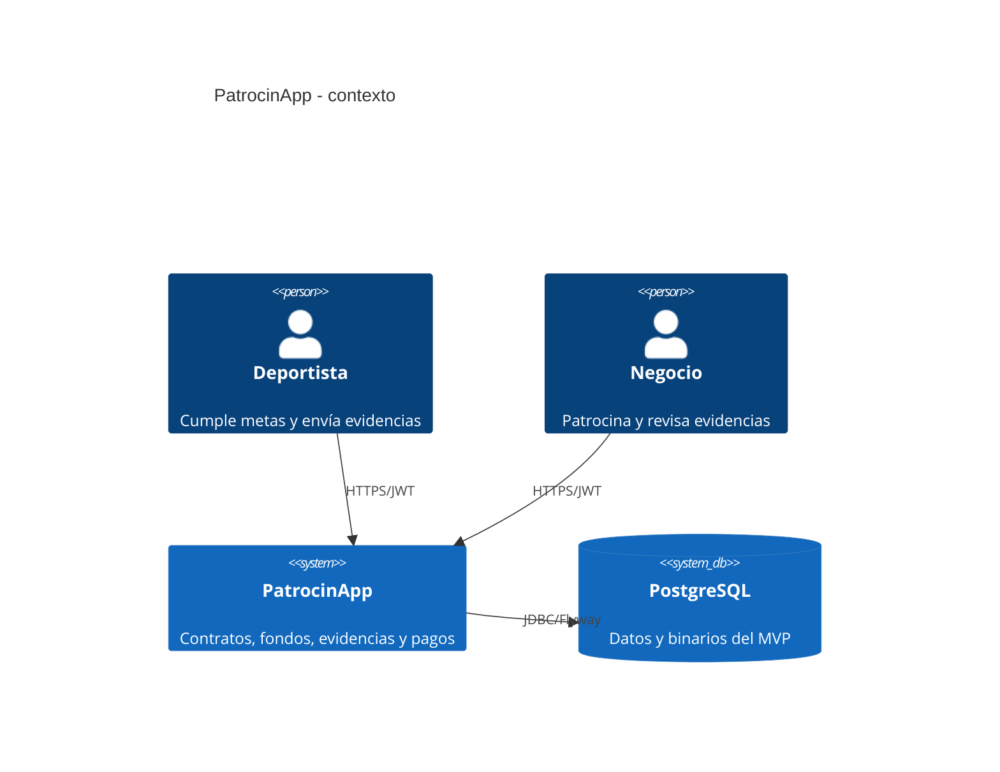
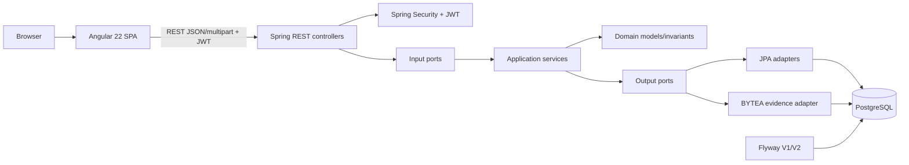
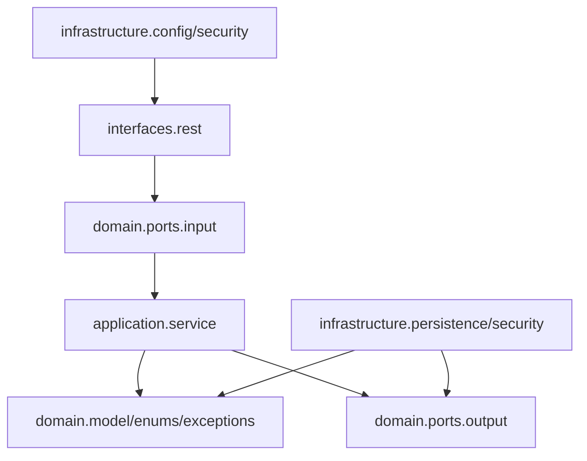

# Diagramas de arquitectura

## Contexto



## Componentes ejecutables



## Paquetes backend



La dependencia apunta hacia el dominio; Spring ensambla implementaciones en infraestructura.

## Despliegue objetivo preparado

```mermaid
flowchart LR
  USER[Browser HTTPS] --> V[Vercel: Angular + runtime-config]
  V --> R[Railway: contenedor Spring Boot]
  R --> H[/actuator/health]
  R --> P[(Railway PostgreSQL)]
  R --> LOG[Logs Railway]
```

Este despliegue corresponde a los manifiestos preparados, pero **no fue ejecutado** al 2026-07-13.
