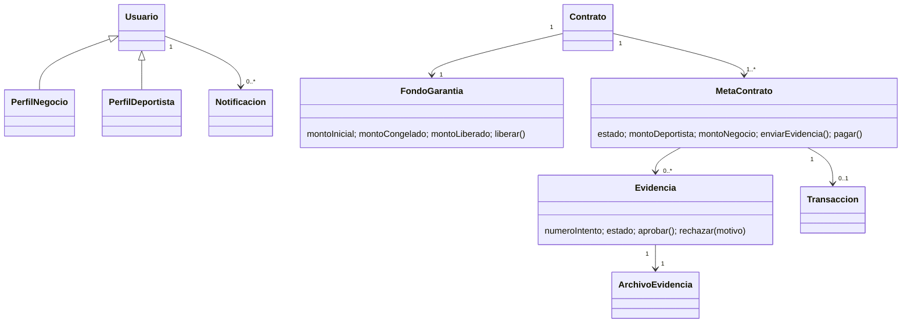
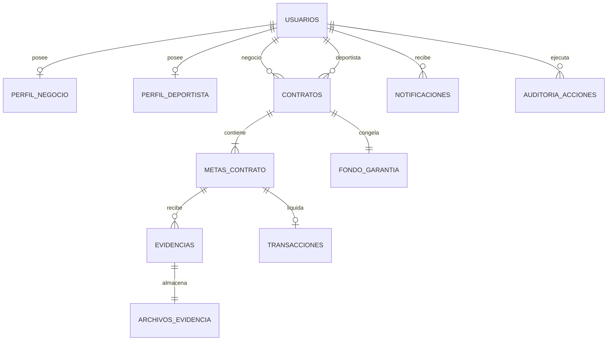
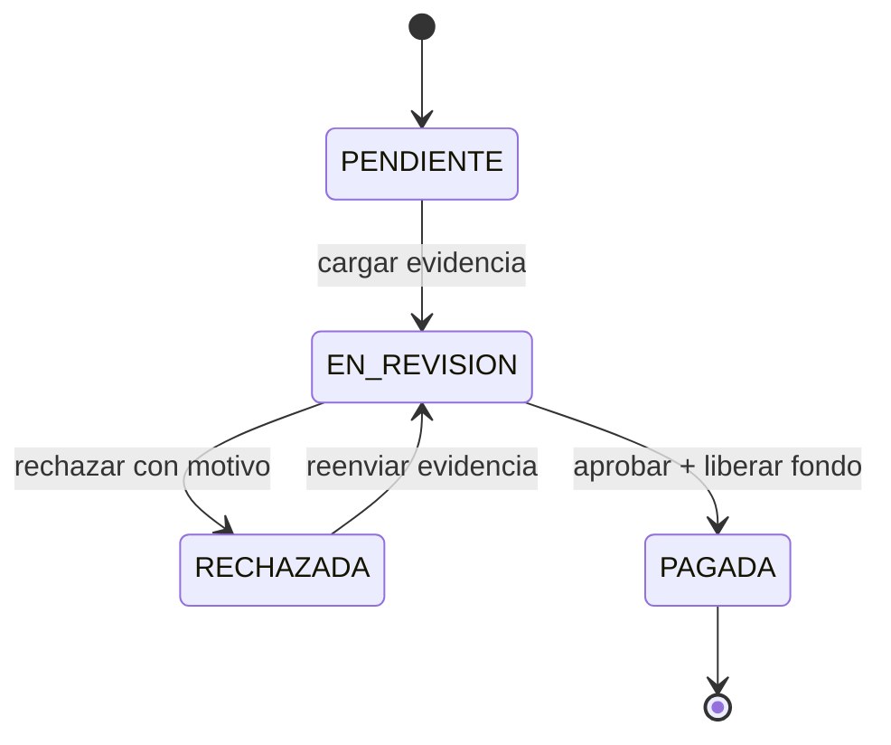

# Dominio, datos y estados

## Dominio

## Entidad-relación actualizado

Claves de consistencia: `UNIQUE(meta,intento)`, índice único parcial de evidencia `EN_REVISION`, `UNIQUE transaccion(meta)`, montos/tamaño positivos, FK y locks/versiones.

## Estado de una meta

El contrato pasa de activo a finalizado cuando todas sus metas quedan pagadas.
