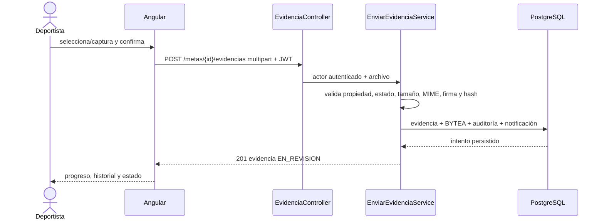
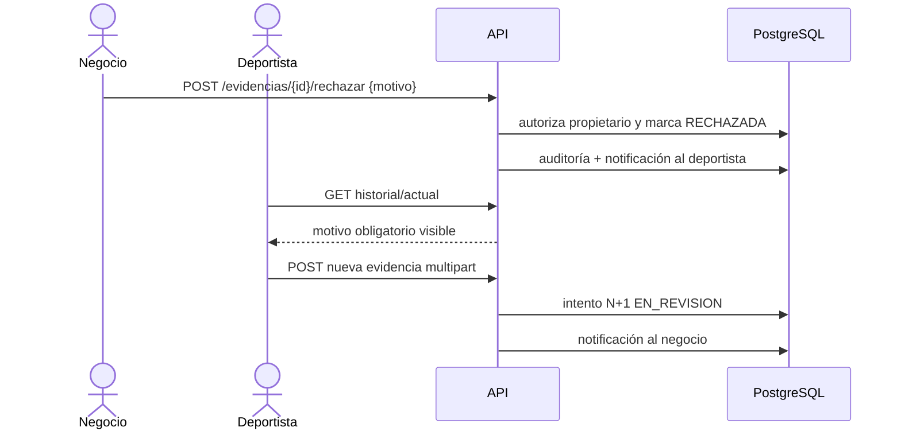

# Secuencias de evidencias

## Carga



## Rechazo y reenvío



## Aprobación y liberación

```mermaid
sequenceDiagram
  actor N as Negocio
  participant API as API
  participant TX as AprobarEvidenciaService
  participant DB as PostgreSQL
  N->>API: POST /evidencias/{id}/aprobar + JWT
  API->>TX: actor propietario
  TX->>DB: BEGIN + locks meta/fondo/contrato
  TX->>DB: verifica EN_REVISION y transacción inexistente
  TX->>DB: evidencia APROBADA + meta PAGADA
  TX->>DB: fondo congelado -= monto; liberado += monto
  TX->>DB: transacción (deportista + comisión)
  TX->>DB: finalizar contrato si todas pagadas
  TX->>DB: notificaciones + auditoría + COMMIT
  DB-->>API: resultado único
  API-->>N: 200; segundo intento responde conflicto
```
