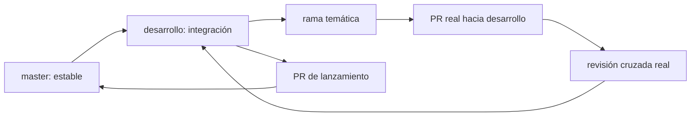

# Plan GitFlow

## Flujo

`master` se detectó como principal del backend. Se creó el tag de respaldo `respaldo/pre-entrega-final-20260713`; la entrega está integrada en `desarrollo`. No se crearon PR, revisiones, publicación ni merge a `master` porque requieren cuentas y aprobación reales.

Ramas usadas: `datos/migraciones-y-auditoria`, `funcionalidad/evidencias-y-rechazos`, `pruebas/flujo-financiero-y-seguridad` e `infraestructura/railway-y-automatizacion`.

Protección recomendada en GitHub (aún no configurada): exigir PR, una aprobación ajena, Actions exitosas, conversaciones resueltas, rama actualizada y prohibición de force-push/deletion en `master` y `desarrollo`.
